# Procesverslag
Markdown is een simpele manier om HTML te schrijven.  
Markdown cheat cheet: [Hulp bij het schrijven van Markdown](https://github.com/adam-p/markdown-here/wiki/Markdown-Cheatsheet).

Nb. De standaardstructuur en de spartaanse opmaak van de README.md zijn helemaal prima. Het gaat om de inhoud van je procesverslag. Besteedt de tijd voor pracht en praal aan je website.

Nb. Door *open* toe te voegen aan een *details* element kun je deze standaard open zetten. Fijn om dat steeds voor de relevante stuk(ken) te doen.

## Jij

### Auteur:
Michiel Schipper

#### Je startniveau:
Rood

#### Je focus:
Surface plane
 

## Je website

Voor mijn website kies ik voor de North kiteboarding website dit is een website van het merk waardoor ik gesponsord wordt. Ik vind dit zelf een erg mooie website. Erg gaaf vorm gegeven en uitgelijnd.

### Je opdracht:
https://www.northkb.com/en/products/kites
North kiteboarding website 

#### Screenshot(s) van de eerste pagina (small screen): 
Product pagina
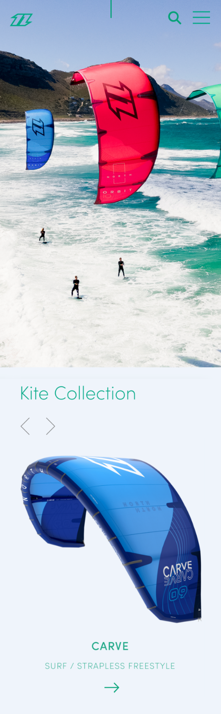

#### Screenshot(s) van de tweede pagina (small screen):
Go Green Pagina 
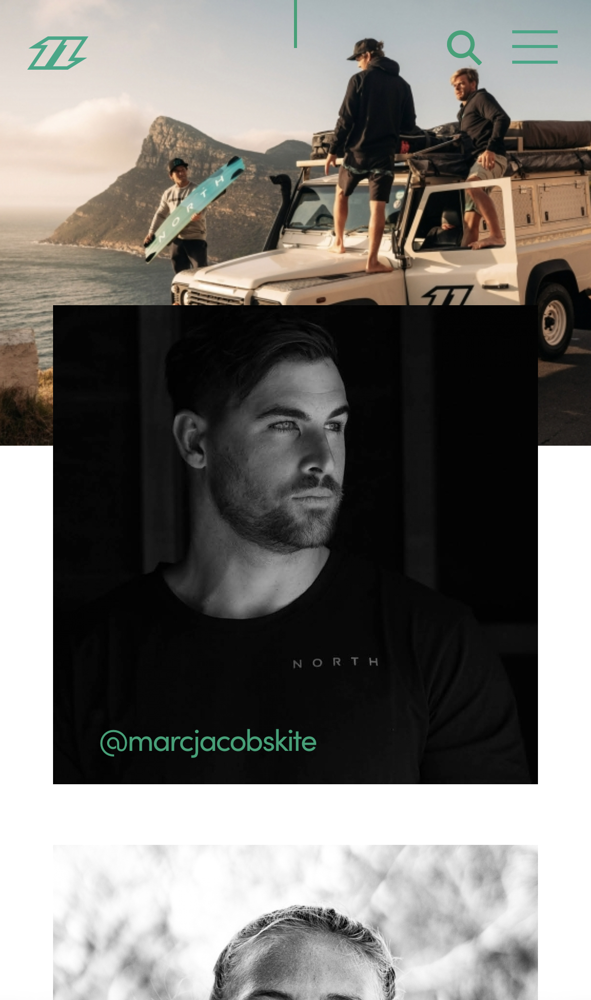
 

## Breakdownschets (week 1)

2e werkgroep

### de hele pagina: 

### dynamisch deel (bijv menu): 

### wellicht nog een dynamisch deel (bijv filter): 

## Voortgang 1 (week 2)

1e voortgang

### Stand van zaken:
Ik was eerst begonnen met het namaken van de website op groot scherm. Echter begreep ik later dat je moest beginnen op klein scherm. Daarom ben ik hier mee begonnen. Zoals altijd met html en css zijn er altijd dingen die stroef lopen. Bij het begin was het lastig om de background img goed te centreren en af te snijden. Daarna was de volgende uitdaging de navgatie goed centreren en de grotes goed krijgen. De navigatie helemaal werkend krijgen ga ik volgende week doen. De volgende uitdaging was de caroussel. Dit is nog geen caroussel maar een auto scroll, dit werkt erg goed. Ik kreeg het alleen nog niet voor elkaar om te scroll snappen. Dit ga ik vragen bij het voortgangs moment. 

### lastig: 
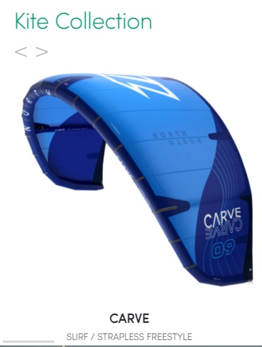

### lastig: 
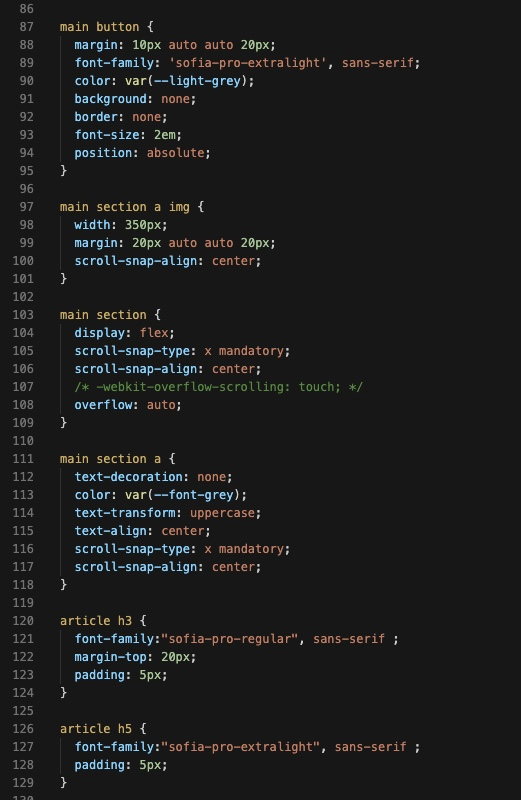

### Agenda voor meeting
samen met je groepje opstellen

| Michiel                       | Oeds          | Youssef    | student 4        |
| ---                           | ---           | ---        | ---              |
| Nav in uitklappen             | niet aanwezig | Niet aanwezig | en dan ik dat    |
| scroll snap in caroussel      |               |               | dit wil ik zeker |
| zoeken en typen               | ...           | ...          | ...              |

### Verslag van meeting
hier na afloop snel de uitkomsten van de meeting vastleggen

Deze informatie heb ik gekregen om mijn problemen op te lossen.
https://developer.mozilla.org/en-US/docs/Web/CSS/overscroll-behavior
https://codepen.io/deannabosschert/pen/PopGXJx
https://codepen.io/Yunusemre18/pen/GREVqqM

## Voortgang 2 (week 3)

2e voortgang

### Stand van zaken
Deze week ben ik aan de slag gegaan met mijn navigatie en de grid. Ik heb de navigatie vrij snel voor elkaar gekregen omdat we dit vorige les hadden besproken. Dit heeft mij veel geholpen. Dit was hetzelfe met de grids. Echter kwam ik erachter dat ik voor mijn twee pagina's alletwee articles gebruik waardoor ik die nu in de css allebei aanspreek. Als ik classes kon gebruiken kon ik dit oplossen maar ik weet nu nog niet hoe ik dat zonder moet doen. 

### lastig: 
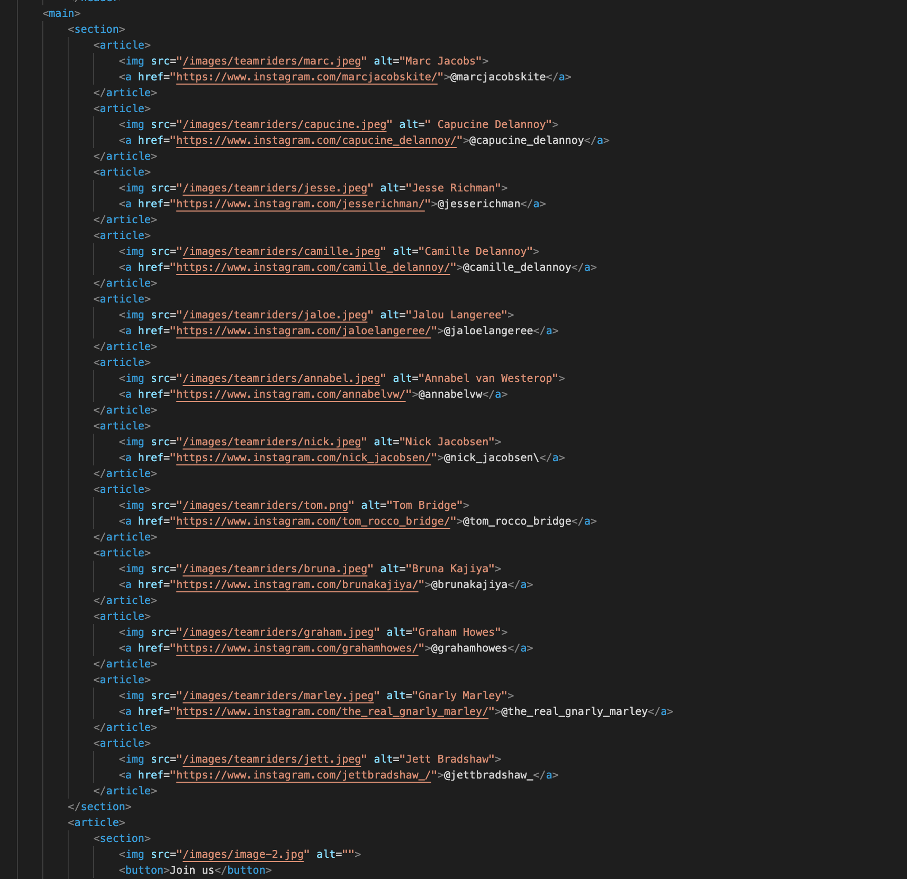

### Agenda voor meeting
samen met je groepje opstellen

| Michiel      | Oeds         | Youssef   | student 4        |
| ---            | ---                | ---          | ---              |
| Zoekbalk functie | Moest nog beginnen        | Geen antwoord gekregen    | en dan ik dat    |
| Twee arcticles in twee pagina's| dit als er tijd is | nog een punt | dit wil ik zeker |
| Lijnen in html          | ...                | ...          | ...              |

### Verslag van meeting
hier na afloop snel de uitkomsten van de meeting vastleggen
Van articles in articles lists maken
Input type search voor zoekbalk

Opacity nav 

List delay nav 

Header van h5 naar h3 

## Toegankelijkheidstest (week 4)

Toegankelijkheidstest uitwerkingen

### Bevindingen
Lijst met je bevindingen die in de test naar voren kwamen:

#### Titel eerste bevinding

Eerste test met alleen toetsenboard Bram

searchbar heeft geen focus. Deze mist hij.

hamburger menu open dicht

gaat door menu heen zonder dat je hem ziet

In dark mode kan je de tekst in de form niet zien.

focus-within

js keydownframes

onderkant pagina blijft hij haken

- Button onderkant pagina die naar boven gaat 

### button: 
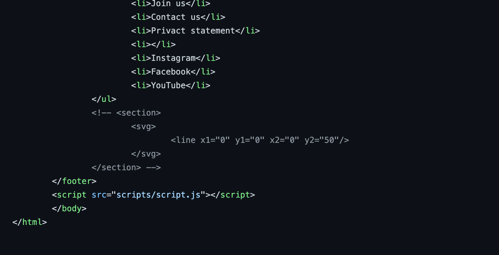
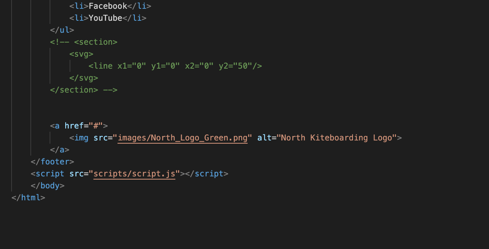

- input buiten de button gezet 

### input buiten button: 
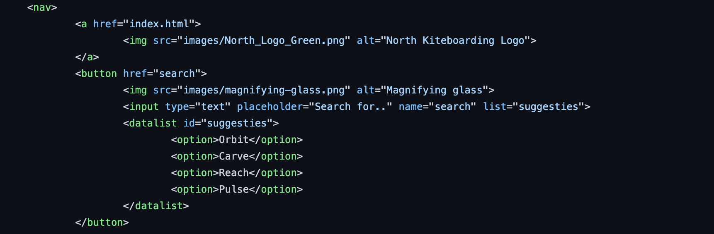
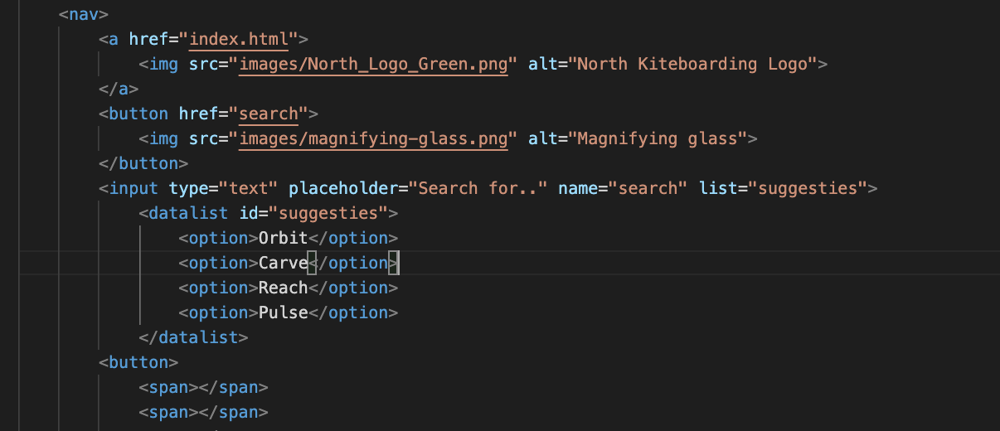

- kleuren van form aangepast

### kleuren form: 
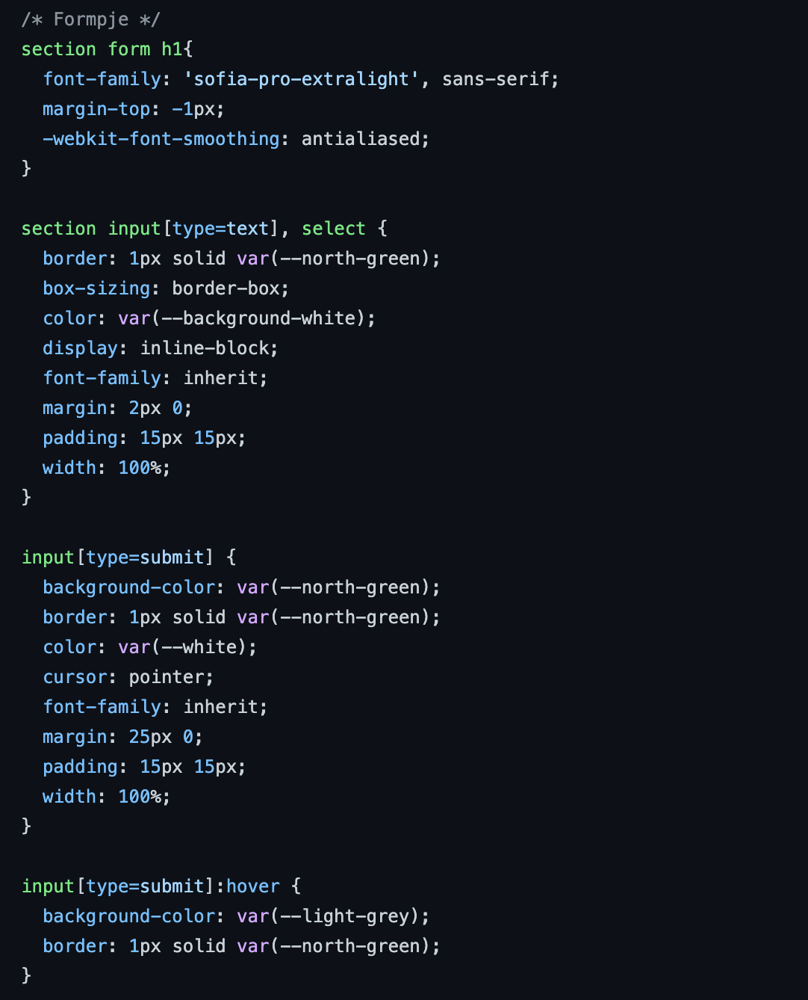
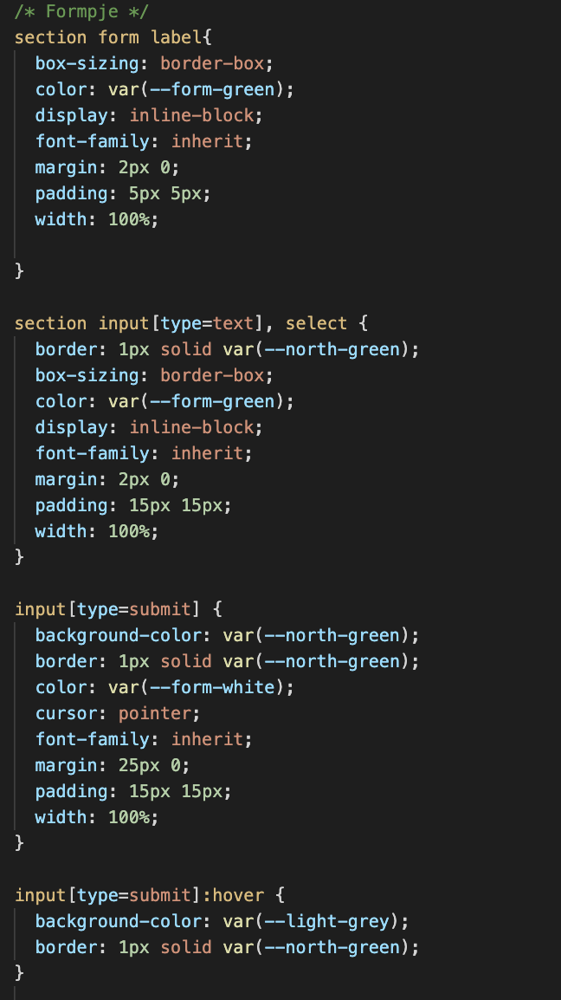

- hamburger menu open dicht zou je kunnen doen met js keyframes en focus within. Dit is voor mij alleen nog te lastig om voor de deadline te doen. 

#### Titel tweede bevinding. 

Oefenen met beperking Marijn

Sommige teksten zijn minder goed te lezen zoals de footer, maar alles is nog wel leesbaar. 

Met parkinson is de website "goed" te bedienen.

Met afleiding is alles nog goed te bedienen. 

- tekst footer groter gemaakt. 

### tekst footer: 
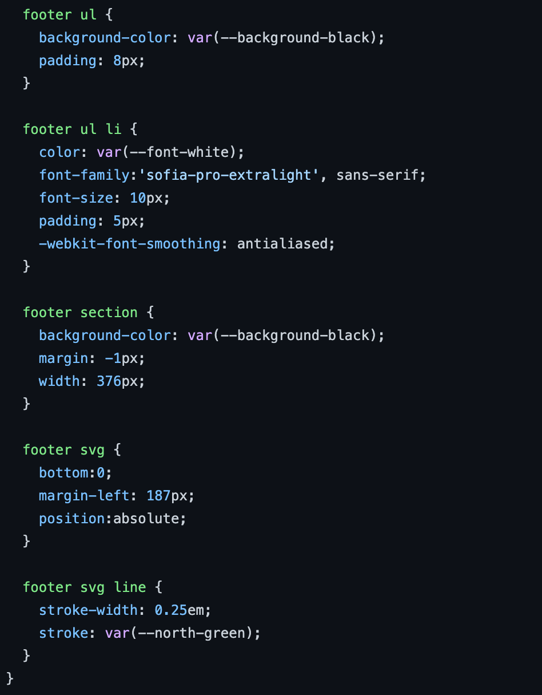
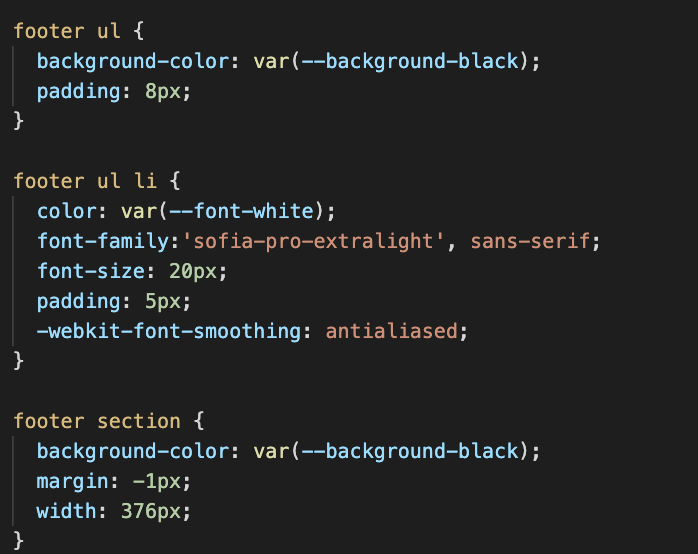

- kleuren van form aangepast

### kleuren form: 

#### Titel volgende bevinding. 

Voor lezen lijkt goed te gaan maar zitten nog een aantal fouten in. 

voice over 

Join us staat in al caps moet klein en staat button achter

Labels aan form toevoegen

- join us staat niet meer in caption 

Dit bleek zo te zijn omdat ik hem in css in uppercase heb staan. Wat goed is, daarom heb ik dit zo gelaten. 

### join us: 
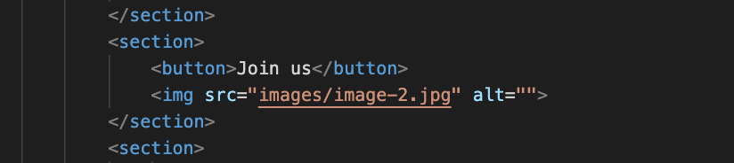

- labels aan forms zijn toegevoegd. 

### button: 
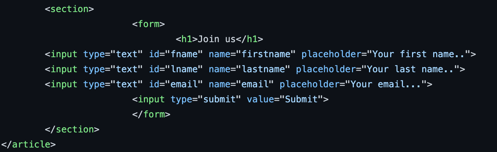
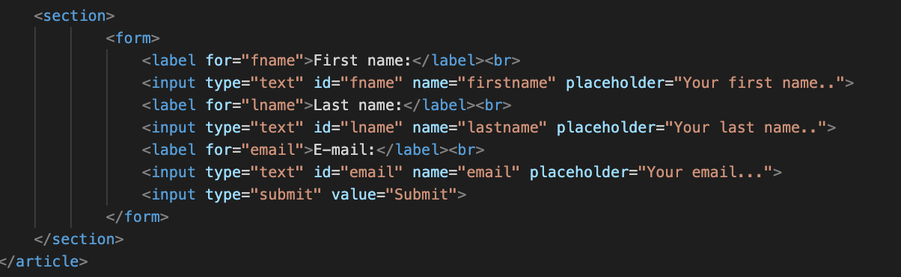

## Voortgang 3 (week 4)

3e voortgang

### Stand van zaken
Het gaat vrij voorspoedig met mijn website, echter heb ik natuurlijk nog wat extra vragen voor het eindgesprek. Waar ik nog niet uikwam was om de website weer omhoog te laten tabben. Op deze manier kunnen gebruikers die alleen het toetsenbord gebruiken eenvoudig weer naar boven aan de pagina komen. Ik wil ook nog vragen wat ik nog extra kan verbeteren aan mijn website. Ik ben ook nog erg benieuwd of er nog fouten in mijn code ziten. 

### Agenda voor meeting
samen met je groepje opstellen

| Michiel                                               | Oeds               | Youssef   | student 4        |
| ---                                                   | ---                | Niet aanwezig    | ---              |
| Bespreken met tab weer bovenaan pagina                | Hoeft niks te bespreken             | en ik dit    | en dan ik dat    |
| Wat kan ik nog extra verbeteren? dit als er tijd is   | nog een punt       | dit wil ik zeker |
| Zitten er nog fouten in mijn code?                    | ...                | ...          | ...              |

### Verslag van meeting
hier na afloop snel de uitkomsten van de meeting vastleggen

max widht max height op img 

Focus op up button

footer li in aparte ul 

br in form mag niet 

H1 neerzetten voor screenreader en google

## Eindgesprek (week 5)

Eindgesprek

### Stand van zaken
Natuurlijk is het altijd een uitdaging om weer te beginnen met html en css na er een tijdje niet meer naar gekeken te hebben. Aan het begin was ik te snel gestart zonder echt de opdracht goed bekeken te hebben. Ik begon meteen op web formaat en ging aan de slag zonder breakdownschetsen gemaakt te hebben. Dit bleek zonde van mijn werk te zijn. De basis was redelijk okay maar na het maken van breakdownschetsen ging alles gelijk veel makkelijker. Natuurlijk loop je altijd tegen dingen aan en zit je soms even met je handen in het haar. Gelukkig was alles redelijk snel opgelost door de hulp van Sanne,studentassistenen en/of google. Uiteindelijk ben ik erg tevreden over het resultaat. Ik heb nog nooit eerder een website nagemaakt. Dit was nieuw en een hele andere manier van werken. Als je zelf een website maakt en je nav staat niet helemaal perfect maakt dat eigenlijk niet veel uit(behalve voor jezelf dan). Nu moest je nog specifieker aan de slag gaan om alles perfect te krijgen. Ik vond het fijn om weer opgefrisd te worden en kan niet wachten op project tech!

### Screenshot(s)

hier screenshot(s) van je eindresultaat

### eindresultaat: 
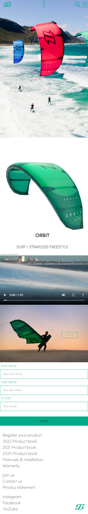

## Bronnenlijst

continu bijhouden terwijl je werkt

Nb. Wees specifiek ('css-tricks' als bron is bijv. niet specifiek genoeg).

Html

1. https://www.w3schools.com/graphics/svg_line.asp
2. https://www.w3schools.com/howto/howto_js_topnav.asp
3. https://www.w3schools.com/howto/howto_css_navbar_image.asp
4. https://www.w3schools.com/howto/howto_js_mobile_navbar.asp
5. https://codepen.io/shooft/pen/dyRVVRr
6. https://codepen.io/shooft/pen/GREMMjV
7. https://codepen.io/shooft/pen/powEdze
8. https://www.youtube.com/watch?v=jx5jmI0UlXU
9. https://developer.mozilla.org/en-US/docs/Web/HTML/Element/datalist
10. https://www.w3schools.com/howto/howto_js_slideshow.asp
11. https://www.w3schools.com/html/html5_video.asp
12. https://www.w3schools.com/html/html_forms.asp
13. https://www.w3schools.com/tags/tag_footer.asp
14. https://www.w3schools.com/howto/howto_js_scroll_to_top.asp
15. Sanne 
16. Studentassistenten
17. https://www.w3schools.com/css/css_grid.asp
18. https://www.w3schools.com/css/css_positioning.asp
19. w3schools.com/html/html_lists.asp

css
1. https://www.w3schools.com/css/css_background.asp
2. https://www.w3schools.com/css/css_margin.asp
3. https://www.w3schools.com/css/css_padding.asp
4. https://www.w3schools.com/css/css_font.asp
5. https://www.w3schools.com/css/css_icons.asp
6. https://www.w3schools.com/css/css_positioning.asp
7. https://www.w3schools.com/css/css_inline-block.asp
8. https://www.w3schools.com/css/css_navbar.asp
9. https://www.w3schools.com/css/css_overflow.asp
10. https://www.w3schools.com/css/css_form.asp
11. https://www.w3schools.com/css/css_rwd_mediaqueries.asp
12. https://www.w3schools.com/css/css_grid.asp
13. https://developer.mozilla.org/en-US/docs/Web/CSS/CSS_Animations/Using_CSS_animations
14. https://www.youtube.com/watch?v=HZHHBwzmJLk&ab_channel=Fireship
15. https://www.sinds1971.nl/fed/animaties/
16. https://codepen.io/shooft/pen/dyRVRGo
17. https://codepen.io/shooft/pen/powKLNz
18. https://codepen.io/shooft/pen/ExXRLXL
19. w3schools.com/css/css_display_visibility.asp
20. https://www.w3schools.com/css/css_overflow.asp
21. https://www.w3schools.com/css/css_dropdowns.asp
22. https://www.w3schools.com/css/css_attribute_selectors.asp
23. Sanne 
24. Studentassistenten
25. https://www.w3schools.com/js/default.asp
26. https://codepen.io/shooft/pen/dyRprgb

